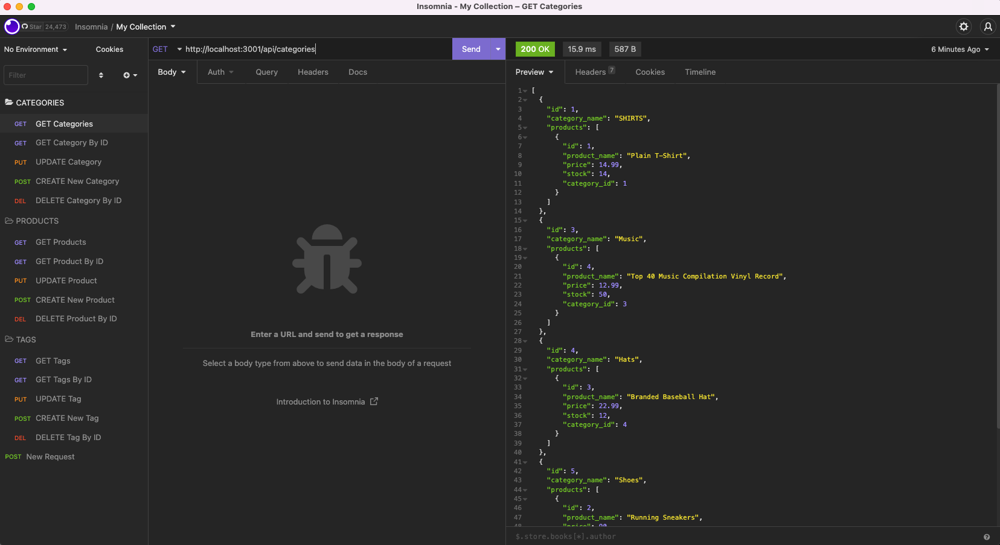

# E-Commerce Back End

[](https://drive.google.com/file/d/1RoMfPX1zURGtyrOuUUGFLcNCwgnFkSM8/view?usp=sharing)
[Link to Video](https://drive.google.com/file/d/1RoMfPX1zURGtyrOuUUGFLcNCwgnFkSM8/view?usp=sharing)

## Description
The project was built to be able to create a back-end for an e-commerce website. Once the server is started, Sequelize models are synced to a MySQL database. The MySQL database is connected by Sequelize. A database is created when a schema is entered and data is seeded when a seed command is entered. API GET routes in Insomnia Core for each of the routes (category, product, or tag) display the data for the route in a formatted JSON. API POST routes for each of the routes (category, product, or tag) in Insomnia Core creates data in the database, API PUT routes updates data, and API DELETE routes deletes data.

## Technologies Used
- JavaScript
- Git
- GitHub
- Node.js
- Express.js
- MySQL

## Usage
Run the following in the MYSQL Shell to create the schema :
```console
DROP DATABASE IF EXISTS ecommerce_db;
CREATE DATABASE ecommerce_db;
```

Run the following in the command line to seed the database:
```console
npm run seed
```

Run the following in the command line to start the application's server:
```console
npm start
```

## License
Please refer to the LICENSE in the repo.

## Author Links
[GitHub](https://github.com/ncguan)